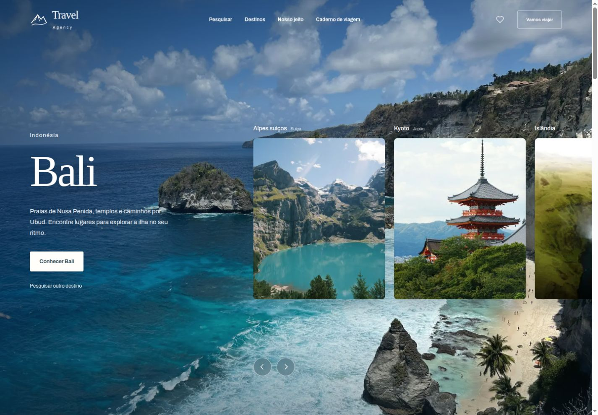

# Travel Agency

Experiência de descoberta de destinos desenvolvida por **Giselly Pereira**. Pesquisa mundial de cidades e atrações, fotografias dos lugares, clima, mapa e favoritos em uma interface com carrossel de tela inteira e scroll suave.

[Visitar o projeto](https://agency-travvel.netlify.app/)



## O que você pode explorar

- Buscar cidades, praias, museus e outros lugares pelo nome, com dados de Open-Meteo / GeoNames e Photon / OpenStreetMap.
- Explorar sugestões por região e filtrar os resultados por país. A home mostra oito lugares por página; “Mostrar mais” substitui o grupo atual.
- Abrir um destino para consultar seu mapa, clima atual, previsão dos próximos cinco dias e lugares próximos por categoria.
- Ver fotografias e contexto via Wikimedia, com créditos de autoria e licença. Quando uma foto não está disponível, o site não atribui uma imagem de outro destino.
- Salvar lugares no navegador e criar um planejamento com época, duração, viajantes e interesses, disponível para baixar em `.txt`.
- Navegar pelo carrossel e pelo caderno de viagem, com layout responsivo, diálogos acessíveis e scroll global com Lenis.

Os itinerários editoriais são sugestões demonstrativas. O projeto não realiza reservas ou pagamentos. A previsão corresponde aos próximos dias, não às datas de uma viagem futura.

## Tecnologias e design

**Next.js 16 · React 19 · TypeScript · CSS Modules · Framer Motion · Lenis**

Fotografia real, paleta azul e papel claro, títulos em serifada e Archivo nos textos da interface. O Lenis integra a rolagem da página, os links internos e a paginação; menus e diálogos mantêm a rolagem própria. A preferência por movimento reduzido desativa o scroll animado.

## Executar localmente

Requer Node.js 22.

```sh
npm ci
npm run dev
```

Acesse `http://localhost:3000`.

```sh
npm run lint
npm run build
npm start
```

## Integrações

A pesquisa mundial, o clima, os lugares próximos e as fotos Wikimedia funcionam sem chaves. Os endpoints do Next.js validam as consultas e as respostas, com timeout, cache limitado e deduplicação de consultas simultâneas. A busca é enviada ao confirmar o formulário.

A descoberta inicial consulta 24 destinos distribuídos pelo mundo; os filtros de região carregam novas seleções. A pesquisa aceita outros nomes, além dessas sugestões. A quantidade de resultados e a disponibilidade dependem dos serviços.

- **Open-Meteo / GeoNames:** geocodificação e clima.
- **Photon / OpenStreetMap:** busca de atrações e lugares próximos, com alternativa via Overpass quando necessário.
- **Wikimedia:** fotografias e contexto dos lugares pesquisados.
- **Geoapify e Pexels:** provedores adicionais disponíveis quando configurados com chaves válidas.

Para habilitar Geoapify e Pexels, copie `.env.example` para `.env.local` e preencha:

```dotenv
GEOAPIFY_API_KEY=
PEXELS_API_KEY=
```

Reinicie o servidor após configurar as variáveis. Na hospedagem, use os mesmos nomes nas variáveis de ambiente. As chaves ficam no servidor; não publique `.env.local` nem use `NEXT_PUBLIC_` para elas.

Favoritos ficam no navegador, sem cadastro. As consultas usam a localização pública do destino escolhido, sem solicitar a localização pessoal do visitante. Consulte os termos dos provedores antes de usar os serviços em produção ou em grande volume.

## Estrutura

- `app/components/travel/`: interface e estilos locais.
- `app/components/SmoothScroll.tsx`: integração global do Lenis.
- `app/api/explore/`: pesquisa, clima, proximidade e fotos.
- `app/api/destinations/`: integrações dos destinos editoriais.
- `app/lib/`: tipos, validação e provedores.
- `app/data/`: conteúdo editorial e coordenadas.
- `public/images/travel/`: fotos otimizadas e [créditos](public/images/travel/SOURCES.md).
- `docs/preview.png`: captura real da interface atual.

## Créditos

Fotografias locais de Unsplash e Pexels; créditos Wikimedia junto aos resultados. Dados atribuídos a [GeoNames](https://www.geonames.org/) e [OpenStreetMap](https://www.openstreetmap.org/copyright). As fontes em `public/fonts/` incluem suas licenças OFL. A captura do README mostra a interface desenvolvida para este projeto.
